# DMailer

DMailer is a [node.js](https://nodejs.org/) app that sends all your gmails to a dicrod channel.

## Requirements

- A Gmail acc (yes it only works for gmail).
- A linux server to run the app.

## Tutorial

### Create a New Google Console Project

In order to use any Google API, there are some prerequisite steps we need to perform. Let's go through these.
To use any Google API, we first need to create a project in the Google console. Head over to the [Google Cloud Platform](https://console.cloud.google.com) and login, then click select project.


We will now create a new Google Cloud project.
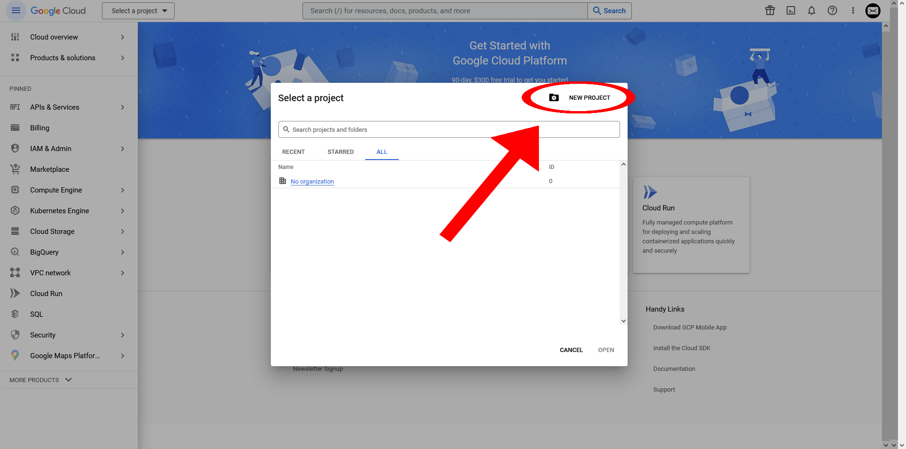

Enter the name you wish to use for the project and click create. And now in a few seconds, you'll have your own new Google Cloud console project created for you. Great!
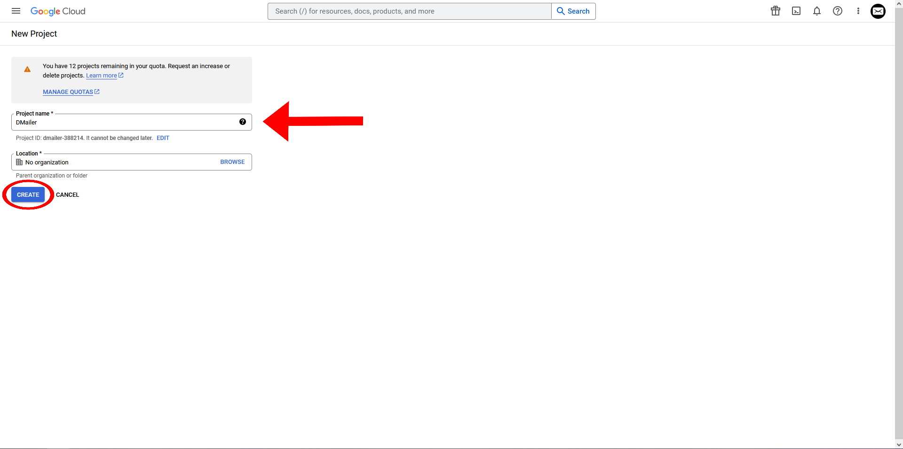

### Enable Gmail API

Firs click select project.
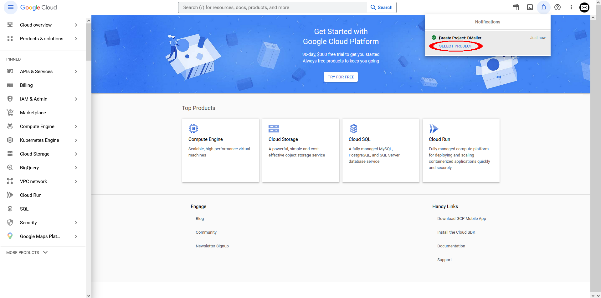

Then, cick on the APIs & Services tab and select Enable APIs & services.
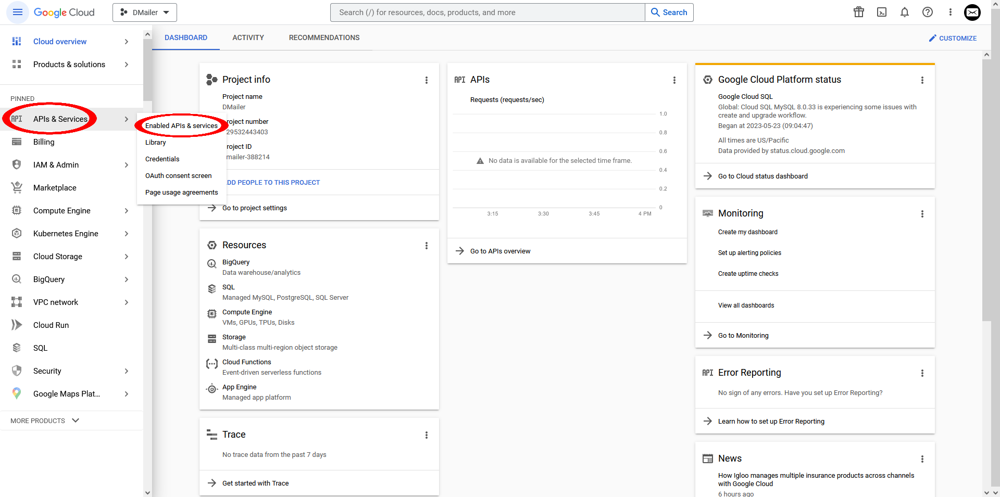

Click ENABLE APIS & SERVICES.
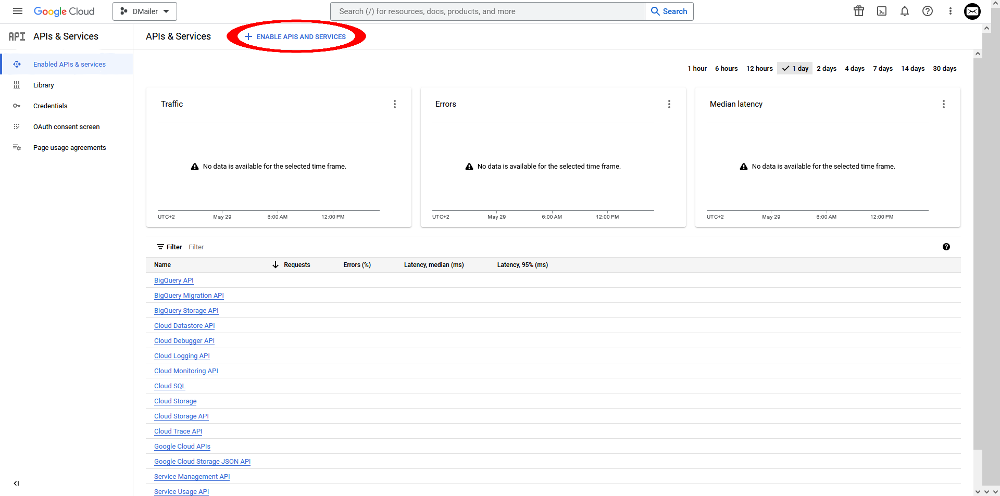

Search for gmail api and select it.


Then click enable.
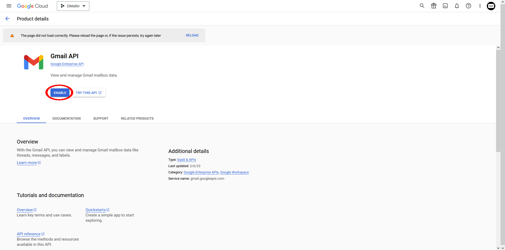

### Add OAuth Consent Screen

Next, we'll add a new OAuth consent screen with some configurations. Inside your project's dashboard, head over to the APIs & Services screen and go to OAuth consent screen, there choose external and click create.
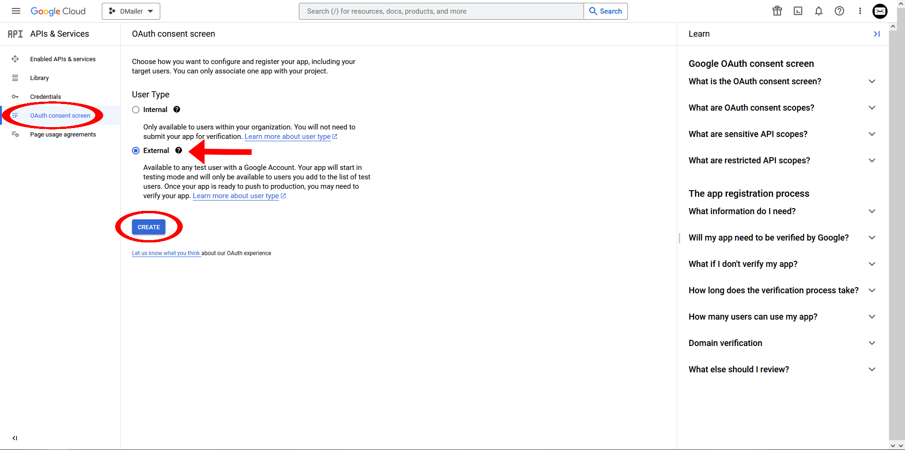

You'll then be prompted to enter some app information. Add that information and click continue

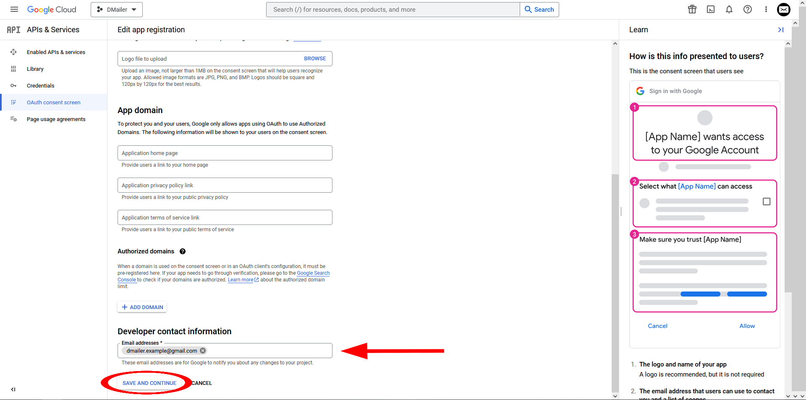

We'll use the default scopes available. So on the next screen, select Save and Continue as it is.
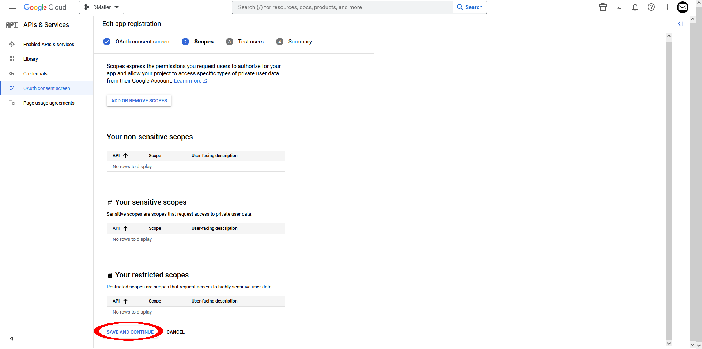

Then, we'll add our own email or an email you'd use to test the app.
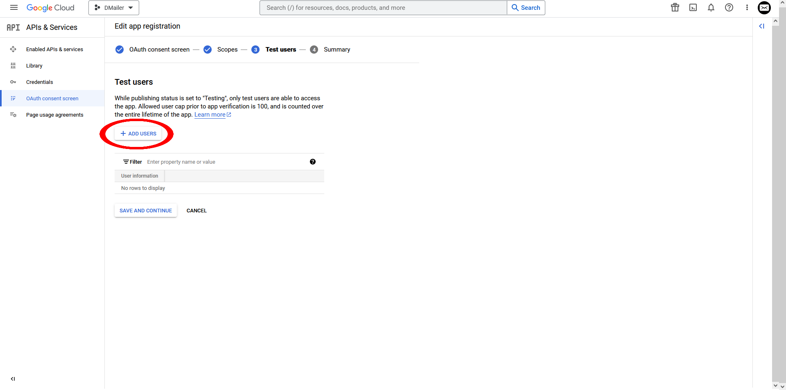
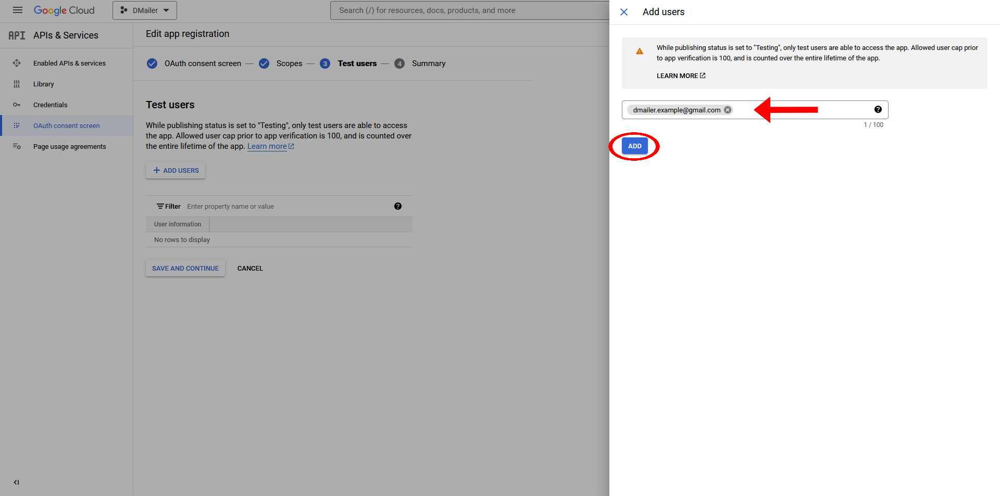

Finally, you can review the app details in the summary. Click Save and Continue.
At this point, your OAuth consent screen has been completely set up. Awesome!
Now we'll go over to the Credentials tab to create an OAuth client ID.


As you can see, we currently do not have any OAuth 2.0 Client ID.
So we'll go ahead and create one by clicking on Create Credentials.
And consequently, select OAuth client ID in the dropdown.
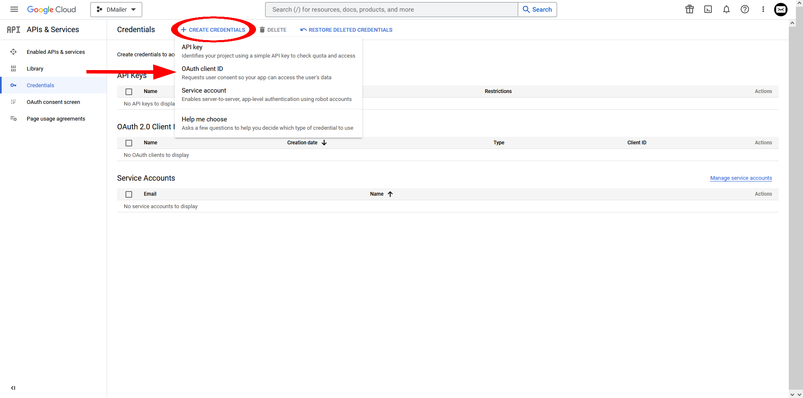

Then, choose Web application as the application type and let the application name be Web client 1.
After that, scroll down to add a redirect URI.
Enter `https://developers.google.com/oauthplayground` inside here.
Make sure the URI doesn't contain a slash (/) at the end.
After that, click on Create to create an OAuth client.
That should create an OAuth client and should also generate some useful client-id and client-secret keys for your project.
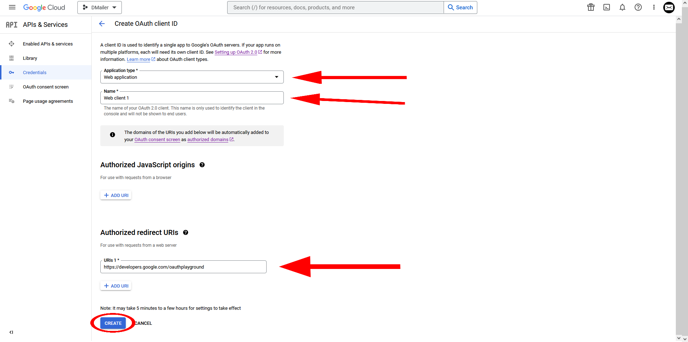

Write the client-id and client-secret down somewhere, we'll need them later.
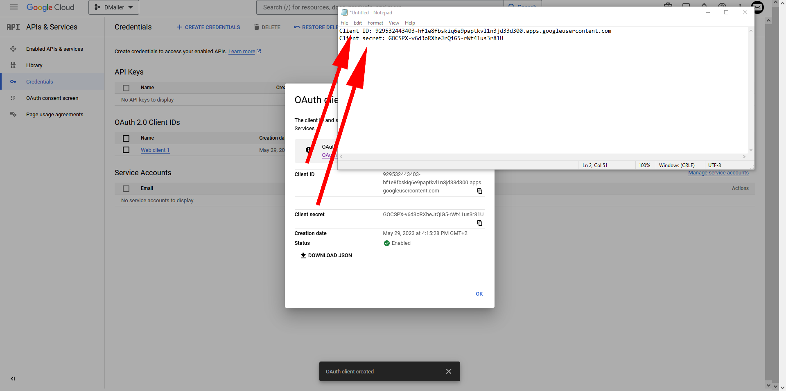

### Generate Access and Refresh Tokens

Now we need to generate an access token that we will use to authenticate our Gmail API requests.
Without it, we won't be able to make legitimate requests to the Gmail API.

To do that, as a first step, we'll visit the redirect URI we added previously.
Head over to [https://developers.google.com/oauthplayground](https://developers.google.com/oauthplayground).
We want to use Gmail API, so we'll put in our scope to authorize the Gmail API.
Put the `https://mail.google.com` scope inside it.
After that, select the gear icon on the right and leave everything as it is.Tick the Use your own OAuth credentials checkbox and enter your OAuth 2 client-id and client-secret.Then click Close.
After that, next to the scope, click on Authorize APIs
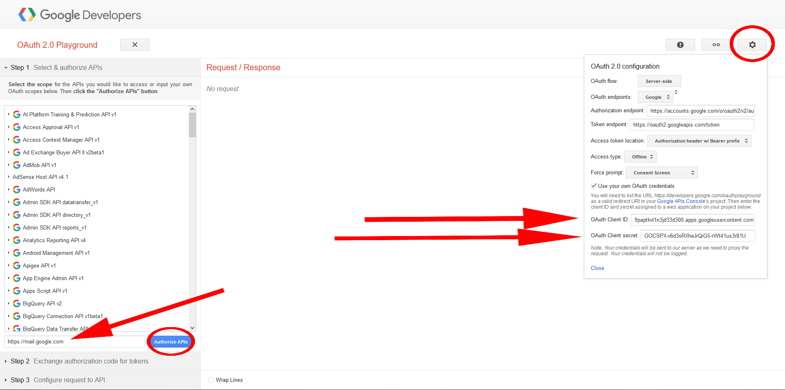

Once you do that, Google will ask you to sign in via your test account.
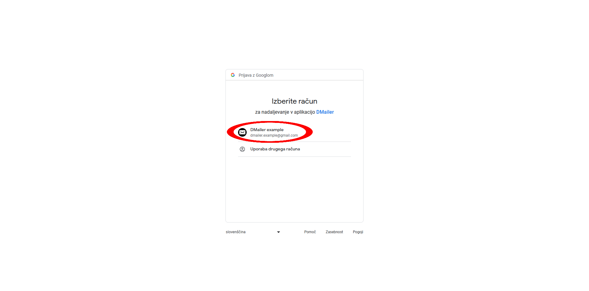

Then it might prompt you that the app is still unverified.
We'll skip the verification since it takes up to two or three days.
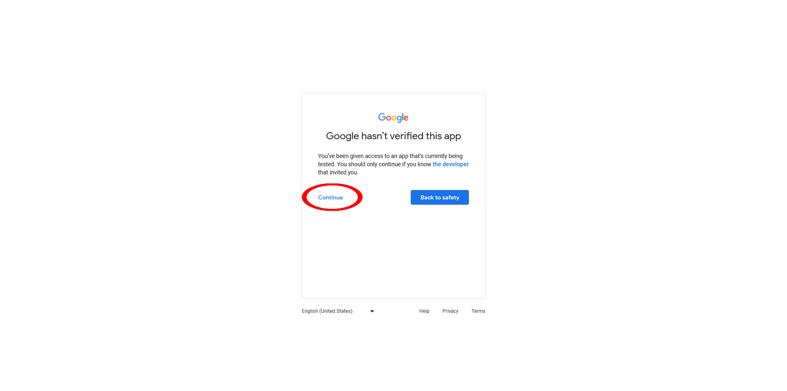

After you click Continue, you'll see your Google Cloud app asking for some permissions.We need to select Continue here as well. This will allow us to do any mail operations from our test account via the Gmail API.
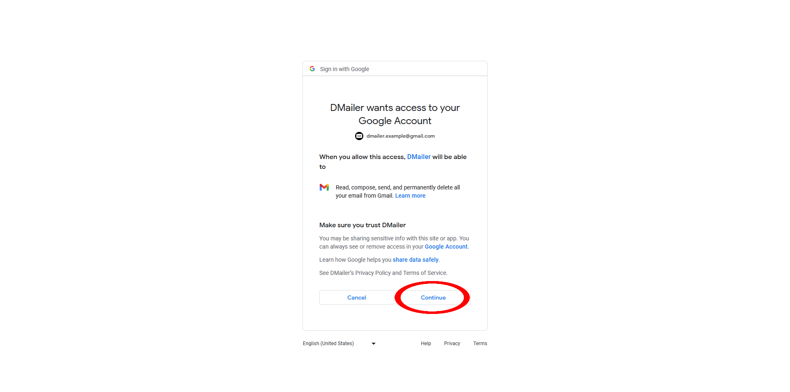

Finally, you should be redirected back to the playground.
Notice how we get back some authorization code now. We will use it to generate refresh tokens and access tokens. Click on Exchange authorization code for tokens and you will get back some refresh tokens and access tokens.
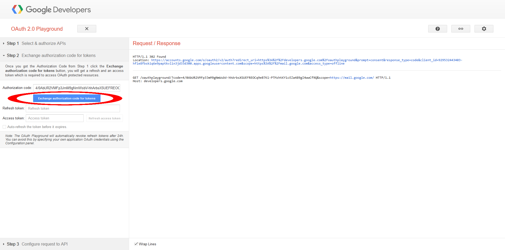

Write the refresh token down somewhere, we'll need it later.
And that's it! You're all set up to start using the Gmail API in a Node.js application.
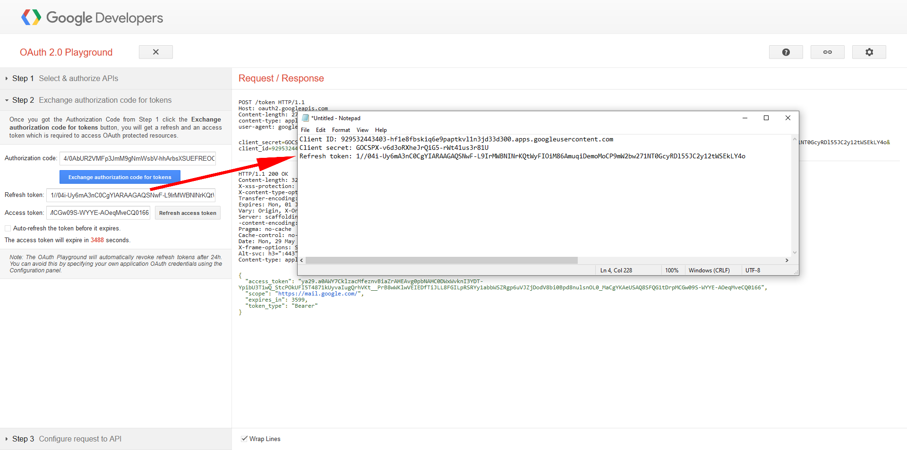

### Get the webhook URL

We also can't forget to get the webhook URL from discord.
You can find it in your discord chanell settings under integrations.
Then copy the webhook URL and save it.


### Setting up the app

First connect to your linux server.
first we check for updates:

```sh
sudo apt update
```

Now will need to install node.js, you will do that by executing:

```sh
sudo apt install nodejs
```

Make sure to have git:

```sh
sudo apt install git-all
```

And with that we are reardy to install the repo:

```sh
git clone https://github.com/ANDREJ6693/DMailer.git
```

Then install the node packages

```sh
npm i googleapis axios discord.js dotenv
```

Now we'll have to change a few files, lets start with .env
cd into DMailer directory and rename template.env to .env, and than enter it with vim or nano:

```sh
mv template.env .env
nano .env
```

There will input the data the .env file requests.


And the last step is to edit the config.js, there you can change the check interval, the whitelist and add custom users:

```sh
nano config.js
```

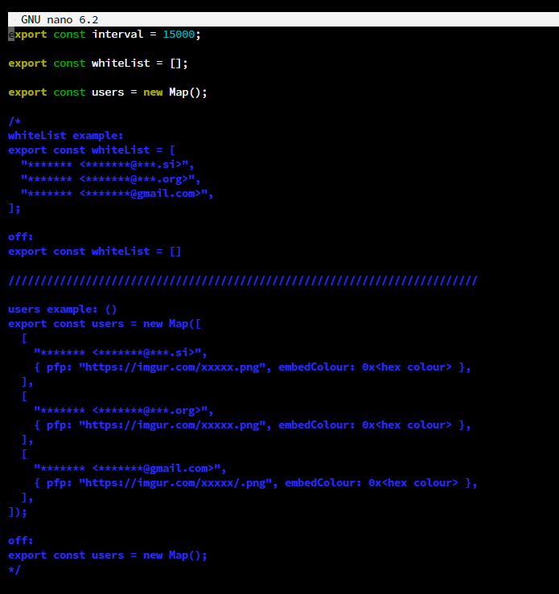

With that you are good to go, just run:

```sh
node app.js
```
